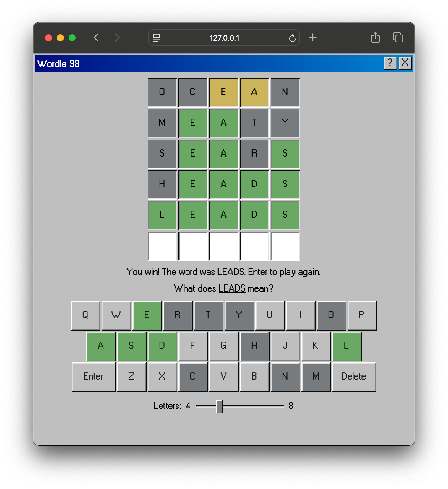
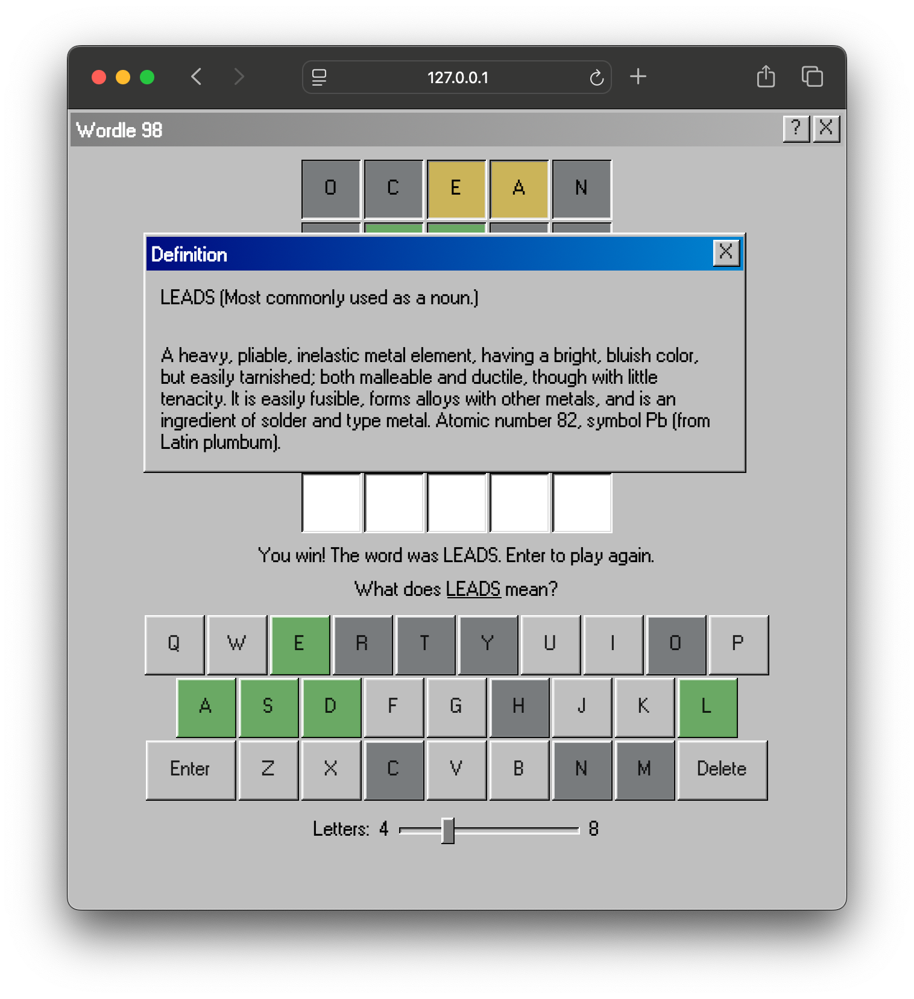

# Wordle 98

Worlde 98 is a remake of the popular [New York Times Wordle](https://www.nytimes.com/games/wordle/index.html) in a Windows 98 aesthetic and with a couple added features.

> 
> 

## Setup

Clone or download the repository and open `index.html` directly in a browser.

## Features

- **Dynamic word length** — a range slider lets you switch between 4 and 8 letter words before a round begins
- **Live word validation** — every guess is checked against a real dictionary API; only real words are accepted
- **Colour-coded feedback** — correct position (green), wrong position (yellow), and absent (grey) hints after each guess, reflected on both the board and the on-screen keyboard
- **Post-game definitions** — after each round, players can click the answer to look up its dictionary definition and part of speech
- **Draggable Win98 modals** — modals can be repositioned by dragging their title bars, exactly like classic Windows windows
- **Dual input support** — physical keyboard and on-screen keyboard both supported, with matching active-key visual feedback
- **Responsive board** — board grid rebuilds automatically when word length changes

## Implementation Highlights

### Two-pass duplicate-letter scoring
Standard Wordle scoring handles duplicate letters with a two-pass algorithm: the first pass locks in exact matches and removes those letters from a working copy of the answer; the second pass scores remaining letters as present or absent. This ensures that a duplicated guessed letter is never counted more than the number of times it appears in the answer.

### Async guess validation with concurrency guard
Guess submission is gated by a `checkingGuess` boolean that prevents multiple simultaneous API requests if a player presses Enter repeatedly before the first response returns.

### CSS custom properties for full theme control
All colours, shadows, spacing, and sizes are defined as CSS variables in `:root`, making visual adjustments — or a full theme swap — a single-file change.

## Stack

| Layer      | Technology |
|------------|------------|
| Markup     | HTML5      |
| Styling    | CSS3 (custom properties, `inset` box-shadow for Win98 chrome) |
| Logic      | Vanilla JavaScript (ES2017+, `async/await`) |
| Fonts      | Custom Windows 98 bitmap-style TrueType fonts |

No frameworks. No build tools. No dependencies.

## APIs

| API | Purpose |
|-----|---------|
| [Random Word API](https://random-word-api.herokuapp.com) | Fetches a random word of a specified length to use as the round's answer |
| [Free Dictionary API](https://api.dictionaryapi.dev) | Validates player guesses and retrieves part-of-speech + definition for the post-game reveal |

Both APIs are free and require no API key.